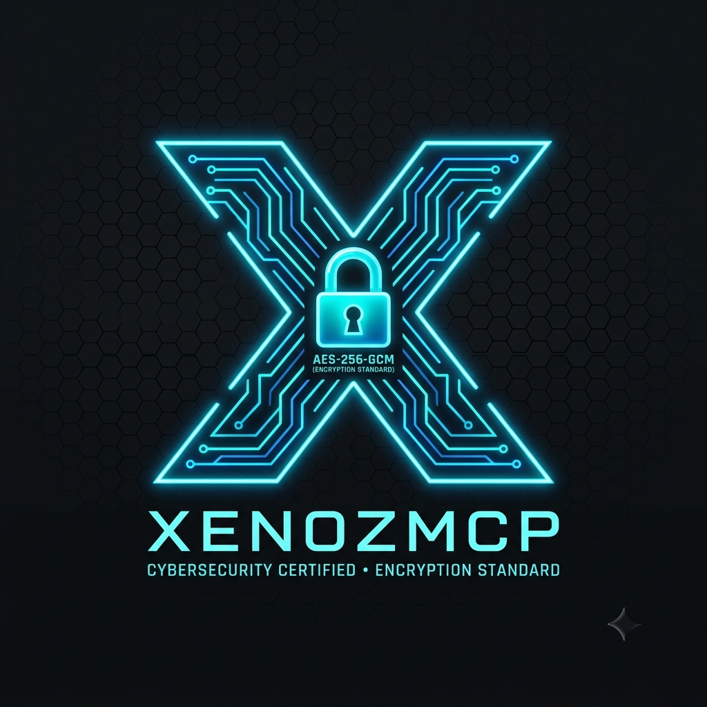

# XenozMCP

<p align="center">
  
</p>

<p align="center">
  <strong>Roblox Studio MCP Server — encrypted, extensible, AI-ready.</strong>
</p>

<p align="center">
  <a href="#"></a>
  <a href="#"></a>
  <a href="#"></a>
</p>

---

XenozMCP is a standalone [Model Context Protocol (MCP)](https://modelcontextprotocol.io) server that connects AI assistants (Claude Desktop, Cursor, Claude Code, etc.) to **Roblox Studio** and the **Roblox Open Cloud API**. It wraps Roblox's native Studio MCP server with an encrypted vault (AES-256-GCM), adds Open Cloud tooling, and provides a clean stdio interface for any MCP-compatible client.

---

## Features

- **Studio Integration** — execute Luau, read/write scripts, capture viewport, inspect instances, control play-testing
- **Open Cloud API** — manage data stores, publish places, list universes, send notifications
- **Encrypted Vault** — AES-256-GCM storage for API keys and secrets (your keys, your control)
- **Auto-discovery** — finds StudioMCP.exe regardless of Roblox Studio version or update path
- **Zero config** — connect and go; no browser extension needed

## Architecture

```
AI Client (Claude Desktop, Cursor, etc.)
  │ stdio transport
  ▼
XenozMCP Server (Node.js/TypeScript)
  ├── Studio Controller → StudioMCP.exe (stdio MCP)
  ├── Open Cloud Client → apis.roblox.com (REST)
  ├── Encrypted Vault   → AES-256-GCM (local)
  └── Tool Router       → 17+ tools
```

## Browser Extension

XenozMCP includes a Chrome/Edge extension that connects **free AI chat sites** directly to Roblox Studio.

### Supported AI Sites
DeepSeek, ChatGPT, Claude, Gemini, Qwen, Mistral, Copilot, Perplexity

### How It Works
```
AI Chat Site (browser tab)
  │ injected content script watches for commands
  ▼
Chrome Extension (background.js)
  │ WebSocket to ws://127.0.0.1:17613
  ▼
XenozMCP Bridge (built-in WebSocket server)
  │ tool execution
  ▼
Roblox Studio MCP
```

### Setup
1. Open `chrome://extensions/` → Developer mode → Load unpacked → select `extension/` folder
2. Run XenozMCP: `start-xenoz.bat` or `node dist/index.js`
3. Open Roblox Studio with a place loaded, enable Assistant → MCP Servers → Studio as MCP Server
4. Open any supported AI site, click **▶ Start Studio Agent**

The AI receives a system prompt telling it which commands are available. It writes commands as JSON code blocks, and XenozMCP executes them on your Roblox Studio automatically.

---

## Quick Start

### Prerequisites

- [Node.js](https://nodejs.org/) 18+
- [Roblox Studio](https://create.roblox.com/) with MCP enabled (Assistant → MCP Servers → Studio as MCP Server)

### Run

```bash
# Clone
git clone https://github.com/Xenoz-GitHub/XenozMCP.git
cd XenozMCP

# Install & build
npm install
npm run build

# Start
node dist/index.js
```

Or double-click `start-xenoz.bat` on Windows.

### Configure with Claude Desktop

Add to your `claude_desktop_config.json`:

```json
{
  "mcpServers": {
    "xenoz-mcp": {
      "command": "node",
      "args": ["path/to/XenozMCP/dist/index.js"]
    }
  }
}
```

## Tools

### System
| Tool | Description |
|---|---|
| `studio_status` | Check Roblox Studio connection status |
| `vault_set` | Store an encrypted value (AES-256-GCM) |
| `vault_get` | Retrieve a decrypted value |
| `vault_has` | Check if a key exists |
| `vault_list` | List all stored key names |

### Studio
| Tool | Description |
|---|---|
| `list_studio_commands` | List all Studio MCP commands |
| `execute_luau` | Run Luau code in Studio |
| `script_read` | Read a script by path |
| `screen_capture` | Capture viewport screenshot |
| `inspect_instance` | Inspect a game instance |
| `start_stop_play` | Toggle play-testing |
| `get_studio_state` | Get Studio state info |
| `search_game_tree` | Search instances by name/class |
| `open_place` | Open a place in Studio |

### Open Cloud
| Tool | Description |
|---|---|
| `cloud_list_data_stores` | List data stores |
| `cloud_get_data_store_entry` | Get a data store value |
| `cloud_set_data_store_entry` | Set a data store value |
| `cloud_get_universe_info` | Get universe info |
| `cloud_publish_place` | Publish a place |
| `cloud_list_places` | List places in a universe |
| `cloud_send_notification` | Send notification to players |

## Configuration

Edit `config.json`:

```json
{
  "openCloud": {
    "apiKey": "your-api-key",
    "defaultUniverseId": "123456789"
  }
}
```

API keys can also be stored securely via the `vault_set` tool at runtime.

## Environment Variables

| Variable | Description |
|---|---|
| `XENOZ_VAULT_KEY` | 64-char hex key for vault encryption |

## License

MIT — see [LICENSE](LICENSE).

---

Built by **XenozExe**.
